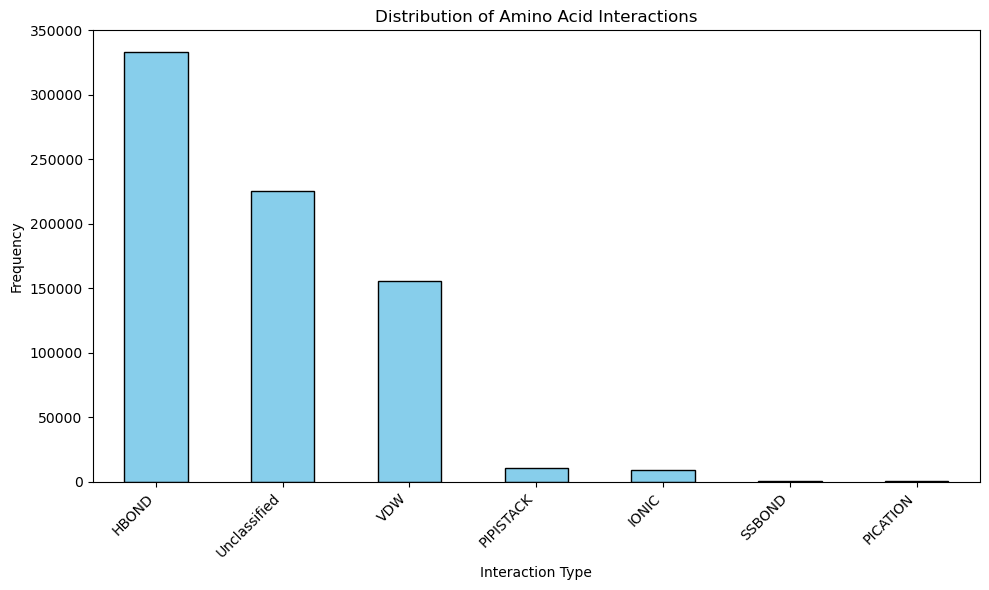
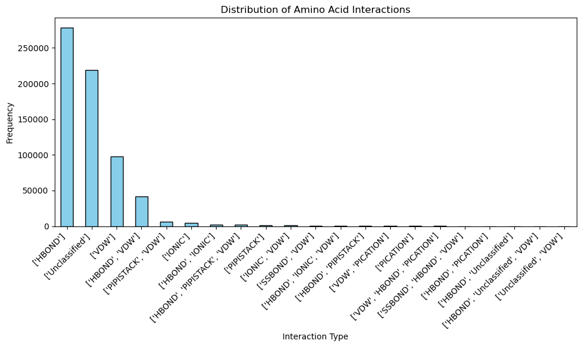
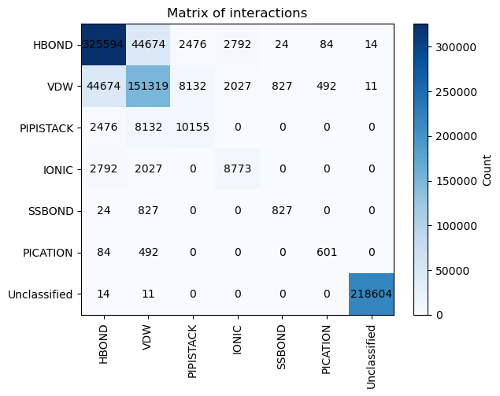
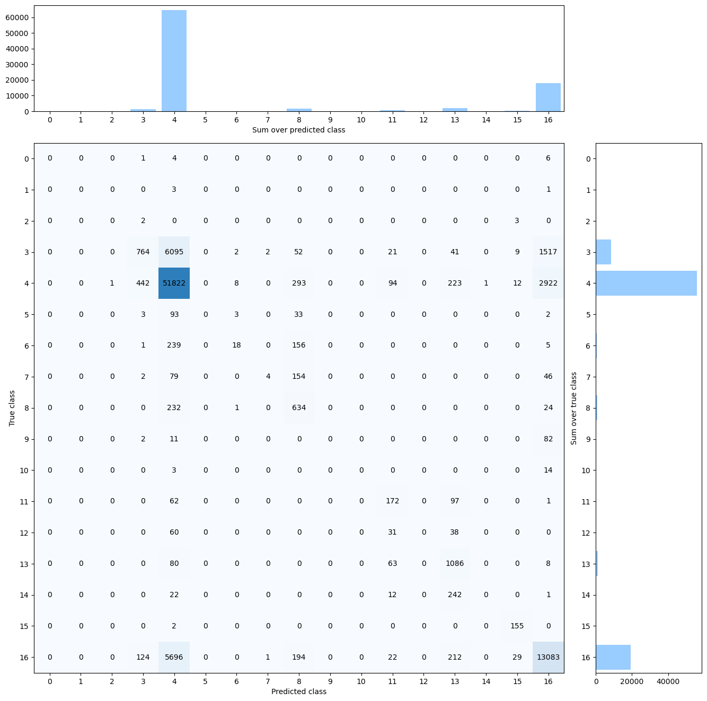
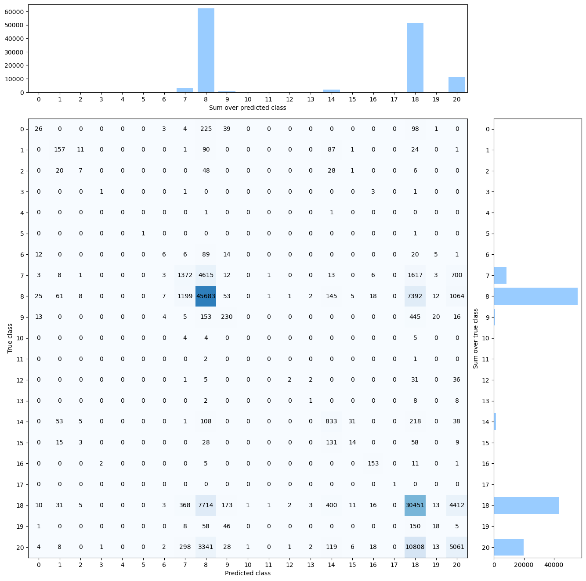

# Enhancing Protein Structure Analysis

<p align="center">Matteo Andriolo, Piermarco Giustini </p>

## Introduction

The Residue Interaction Network Generator (RING) is a cutting-edge tool in the field of structural biology that has significantly advanced the study of protein structures. By identifying non-covalent interactions at the atomic level, RING allows researchers to delve into the intricate details of residue interactions within protein structures.

One of the primary objectives of RING is to provide a straightforward and intuitive way to visualize these interactions, offering researchers valuable insights into the relationships between different residues in a protein. By processing multi-state structures, including molecular dynamics and structural ensembles, RING generates probabilistic networks and conformation-dependent contact maps. The remarkable aspect of RING is its exceptional speed, as it scales linearly with the size of the input data, ensuring efficient and rapid analysis of protein structures.

In this project we are going to develop a script that will be able to predict the interactions between residues in a protein structure, given a dataset of protein structures with their corresponding interactions.

In our code, we have prioritized flexibility, allowing us to experiment with different configurations and observe the prediction results in the output. This adaptability empowers us to fine-tune our analysis and explore various scenarios effortlessly.

## Software

### Requirements

#### Conda environment

In the [GitHub repository (www.github.com)](https://github.com/Reevoc/Enhancing-Protein-Structure-Analysis) is provided the `requirements.txt` file which contains all the librarie necessary correct execution of the software.

 [Install conda enviroment](https://docs.conda.io/projects/conda/en/latest/user-guide/install/linux.html)  and execute

```bash
$ conda create --name your_new_env_name --file requirements.txt
$ conda activate your_new_env_name
```

#### Inference

To just use del model to predict the evaluation you can use the inference.py file with the following command:

- In this first case the model just need a bdb_id of a protein structure and and calculate automatically the features:

  ```bash
  $ python3 inference.py -p "pdb_id_protein" -o "output_file.out"
  ```

- In this second case it can be provided a folder with multiple pdb files in **.cif** format the script will calculate the features for each protein structure and then predict the interactions.

  ```bash
  $ python3 inference.py -m "name_of_the_model" -f "folder_pdb" -o "output_file.out"
  ```

- Example of usage:
  
  ```bash
  $ python3 inference.py -m eliminate_unclassified.h5 -f data/pdb -o output_file.out
  ```

  ```bash
  $ python3 inference.py -m eliminate_unclassified.h5 -p 1b0y -o output_file.out
  ```

In the output file will be present the interactions predicted for each residue of the protein structure, and the pdb_id and s_resi and t_resi.

| pdb_id | s_resi | t_resi | Prediction |
|--------|--------|--------|-------------|
| 1b0y   | 28     |76      | HBOND       |
| 1b0y   | 28     |76      | HBOND:VDW        |

#### Dataset

In folder `./data` there are present:

* `features_ring.zip` : zip file which contains labeled residue interactions  (using RING)
* `data_part_*a` : multiple files which represent the entire dataset composed of the PDB structures in the `mmCIF` format and, for each of them, features generated by our script, used for training.

Data will be better explained in [[#Dataset]]

In order to extract the dataset is provided a bash script  to be executed with

```bash
$ ./data/unpack.sh
```

## Code

The bioinformatics project's source code is organized as follows:

1. **Root Folder:**
    * `train.py`: This file serves as the entry point for executing the training process.
    * `configuration.py`: Contains general setup variables that can be modified to adjust the origin data location, neural network training parameters, and other relevant parameters.
    * `study_data.py` File used to plot our data in the report it contains, cells that can be run providing the correct path to the data, to generate the images.
2. **`./src` Folder:**
    The `./src` folder houses various modules that contribute to different aspects of the project.
    * `features.py`: This module contains functions useful for generating the feature datasets.
    * `manage_data.py`: Responsible for managing the datasets, including handling PDB structures, feature files for PDB structures, and constructing datasets for training.
    * `mkdssp`: binaries required by the Biopython module to generate DSSP features.
    * `neural_networks.py`: Contains the necessary code for creating TensorFlow models, performing training and evaluation, and predicting interaction types.
    * `normalization.py`: This module contains functions for normalizing datasets before feeding them into the neural network.
    * `spilt.py`: Additional utility functions for generating training and test datasets for the neural network.
   

### Usage of the script

The `train.py` script allows you to train and evaluate different models with various normalization techniques and data options. To run the script, you can use the following command-line arguments:

```bash
$ python3 train.py -m [model] -n [normalization] -d [data_option] -k[kfold]
```

#### Parameters

* `[model]`: Choose one of the available models:
   Each model represents a specific machine learning model or architecture.
  * "model_1"
  * "model_2"
  * "model_3".
* `[normalization]`: Choose one of the available normalization techniques:
  This parameter allows you to preprocess the data before training the models.
  * "MinMaxScaler"
  * "StandardScaler".
* `[data_option]`: Choose one of the available data options
  This option determines how the unclassified data is handled during training and evaluation.
  * "eliminate_unclassified" [default]
  * "unclassified"

#### Example

```bash
$ python3 main.py -m model_1 -n MinMaxScaler -d eliminate_unclassified
$ python3 main.py -m model_1 -n MinMaxScaler -d unclassified
# ... (similar commands for other models and combinations)
```

Feel free to experiment with different combinations to find the best configuration for your specific use case.

By following these instructions, users can easily utilize the `main.py` script and explore various models, normalization techniques, and data options to identify the optimal configuration for their machine learning tasks.

## Dataset

The first look at the project was given to the provided datasets, which contain different types of geometrical information about the protein structures. The data are divided into two parts: the source amino acid and the target amino acid. The source amino acid refers to the amino acid that is going to interact with the target amino acid. The data for the source and target amino acids are provided in a CSV file with the following columns:

* **pdb_id**: The id of the protein structure.
* **ch**: The chain of the protein structure.
* **resi**: The residue number of the amino acid.
* **resn**: The name of the amino acid.
* **ss8**: The secondary structure of the amino acid, calculated with DSSP.
* **rsa**: The relative solvent accessibility of the amino acid, calculated with DSSP.
* **phi**: The phi angle of the amino acid, ramachandran plot used to determine the angles.
* **psi**: The psi angle of the amino acid, ramachandran plot used to determine the angles.
* **up**: Half sphere exposure of the amino acid.
* **down**: Half sphere exposure of the amino acid.
* **ss3**: secondary structure
* **a1 to a5**: Atchley scale of the amino acid.
  * These scores represent properties such as polarity, secondary structure, molecular volume, codon diversity, and electrostatic charge.

### Looking at the data

Upon careful examination of the data and file, we have observed instances where certain rows are identical, except for the interactions recorded. This occurs because a pair source-target amino acid can be labelled with multiple types. As a result, we encounter a challenge of having duplicated data entries within the dataset.

To address this issue, we grouped up interactions and by doing so we merged the multiple interaction into a single one.

To achieve this, we utilize a dictionary structure. The key of the dictionary comprises the `(pdb_id, s_resi, t_resi)` values. By using this key, we can identify and select the duplicated rows within the same file of the dataset. Subsequently, we append the corresponding interactions to the "interaction" column.

By employing this approach, we effectively consolidate the duplicated data entries and store the diverse interactions of the amino acid within a single row. This enhances the clarity and efficiency of our dataset, avoiding unnecessary duplication of information.

*Example of duplicated rows*:

| pdb_id | s_resi |...| t_resi |...| Interaction |
|--------|--------|---|--------|---|-------------|
| 1b0y   | 28     |...|76      |...| HBOND       |
| 1b0y   | 28     |...|76      |...| VDW         |

*Solution provided*:

| pdb_id | s_resi |...|t_resi |...|Interaction|
|--------|--------|---|-------|---|------------|
| 1b0y   | 28     |...|76     |...|[HBOND, VDW]|

### Adding New Features

To improve the accuracy of our predictions regarding interactions between amino acids, we realized that the existing dataset was insufficient. Therefore, we decided to augment the dataset with additional data. Prior to this decision, we conducted preliminary experiments using simple prediction models. These models and their outcomes will be presented in detail later in the report, providing a clearer understanding of our rationale.

The first step involved incorporating a new set of data obtained from the DSSP module. To achieve this, we made modifications to the code provided by our professor and then implemented inside the `features.py` file. During this process, we also identified and rectified errors present in the code, which were caused by the use of deprecated libraries. By addressing these issues, we ensured the proper functionality of the code and obtained the necessary data from the DSSP module (which binaries are also provided in `./src/mkdssp`).

[Download Multiple Files from the PDB Archive (<www.rcsb.org>)](https://www.rcsb.org/downloads)
To address the absence of PDB files associated with `features_ring` dataset provided, we developed a Python script that automatically downloaded structures for each of the provided interaction files. However,considering the vast quantity, we noticed notable slowdowns in the download speed after a certain amount of consecutive downloads. An alternative solution we found was to use a bash script, `batch-download.sh`, provided directly by RCSB PDB [(link)](https://www.rcsb.org/docs/programmatic-access/batch-downloads-with-shell-script). This script had the same limitation as ours.
The most efficient solution we landed on was to download the entire dataset from [Download Multiple Files from the PDB Archive (www.rcsb.org)](https://www.rcsb.org/downloads).

Out custom features are automatically calculated only once at `main.py` execution.

### New Features

The new features incorporated into the the dataset consist of 8 features each for the source and target amino acid. These features characterize strength hydrogen bond interactions between the amino acids and are obtained from the official DSSP algorithm.

Example of the new features **"N-H-->O"**:

The hydrogen bond interactions are denoted by the notation "N-H-->O", where "N-H" represents the hydrogen donor (N-H group of the source amino acid), and "O" represents the hydrogen acceptor (C=O group of the target amino acid). The numbers associated with each hydrogen bond indicate the **distance between the two amino acids** involved in the interaction. For example, "-3, -1.4" signifies that if the source residue is residue "i", then the N-H group of "i" forms a hydrogen bond with the C=O group of "i-3" (three residues before "i") with an **electrostatic hydrogen bond energy** of "-1.4 kcal/mol".

By integrating these new hydrogen bond features into the dataset, we acquire valuable information about the interactions between amino acids.
Also we have added all the bonds features that are present in the DSSP module.

[DSSP official Documentation](https://swift.cmbi.umcn.nl/gv/dssp/)

### Data preprocessing

In our research, we encountered a challenge where not all interaction types could be accurately classified using the ring-based method. This resulted in a considerable number of interactions being labeled as **unclassified** in our dataset. The presence of unclassified interactions poses a significant issue as it negatively impacts the quality of our data, ultimately reducing the neural network's capability to learn effectively.

To better understand the impact of these unclassified interactions, we conducted two different experiments. The first experiment involved using the original dataset, including the unclassified labels. The second experiment, called **"eliminate_unclassified,"** was designed to exclude the unclassified interactions from the dataset entirely. The objective was to compare the performance and coherence of the neural network when trained on both versions of the data.

During the experimentation process, it became evident that using the unclassified labels resulted in non-coherent data for the training of the neural network. As a consequence, the overall performance of the model deteriorated compared to the version where unclassified interactions were removed.

### Analysis of the interactions


**Figure 1**: In this figure, we observe the distribution of interactions in the dataset provided for the project. It is evident that the majority of interactions fall under the categories of **HBOND** and **Unclassified**. Conversely, **SSBOND** and **PICATION** are found to be almost non-existent in the dataset.


**Figure 2**: In this figure, we observe the distribution of interactions in the newly created dataset. As anticipated, the interactions that are most prevalent remain consistent with our previous findings, being primarily **HBOND** and **Unclassified** interactions. Additionally, we have discovered the emergence of new interaction pairs, which represent instances where certain interactions are highly likely to co-occur. These findings provide valuable insights into the relationship between different interactions within the dataset.



**Figure 3**: In this matrix, we counted how many times two interaction types appeared together in the same residue-residue interaction, as identified by the RING algorithm. However, a significant issue becomes apparent: certain interactions are overly represented compared to others. This imbalance in representation poses a considerable challenge and warrants further investigation.

### Normalization of the data

Normalization in neural networks is crucial for achieving consistent scaling, stable learning, gradient prevention, and improved model generalization. It enables efficient optimization, accommodates diverse data, and enhances activation function performance. We utilized several transforms from scikit-learn in Python:

* **MinMaxScaler**: Scales data to a specific range, typically between 0 and 1. This ensures all features are on the same scale, benefiting certain machine learning algorithms sensitive to feature magnitudes.

* **StandardScaler**: Standardizes data by removing the mean and scaling each feature to have unit variance. It ensures all features have a mean of 0 and a standard deviation of 1, making them comparable regardless of their original units or distributions.

Particular care was given to :

* **Normalization of Categorical Features:**
   Categorical features represent different categories or labels, such as types of structures or residues. To transform these categorical labels into numerical representations, a technique called **LabelEncoder** which is followed by MinMaxScaler. This transformation enables the categorical features to be used effectively in machine learning algorithms and analysis.
* **Encoding of bond interaction:**
   These interactions describe the relationships between amino acids. To represent these interactions numerically, we utilized a technique called LabelEncoder. Each unique bond interaction is mapped to a unique integer, enabling the in interactions to be expressed as numerical values in the dataset.

By applying these normalization techniques, the data is prepared in a standardized and comparable format. This ensures that the various features are on a consistent scale, allowing for accurate analysis, modeling, and interpretation of the data.

## Multiclass Classification Problem

In the field of machine learning, classification tasks involve the categorization of data into predefined classes or labels. Two common types of classification tasks are multilabel classification and multiclass classification. In multilabel classification, each instance can be associated with multiple labels simultaneously, allowing for the presence of more than one label per data point. For example, in our scenario, an interaction can be classified as both "type A" and "type B" simultaneously. On the other hand, multiclass classification assigns each instance to only one label from a set of predefined classes, restricting each data point to a single label.

In our implementation, we have generated and labeled unique type interactions. The task is to infer the label for each interaction between residues, as determined by the DSSP algorithm. Each residue will be assigned one label representing its type or combination of types, but not multiple labels.

### Neural Network Models

We tested multiple neural network models in an attempt to find the best one. Here, we provide examples of three of them:

1. A model with many layers but a small number of parameters.
2. A larger model with many layers.
3. A large model with a low number of layers.

There was no clear victor, but marginal improvements were observed in certain scenarios. The results will be explained in more detail later in Results

#### Model1

```python
_____________________________________________________________
 Layer (type)                Output Shape              Param    
=================================================================
 dense (Dense)               (None, 128)               5504      
                                                                 
 batch_normalization (BatchN (None, 128)               512       
 ormalization)                                                   
                                                                 
 dropout (Dropout)           (None, 128)               0         
                                                                 
 dense_1 (Dense)             (None, 64)                8256      
                                                                 
 batch_normalization_1 (Batc (None, 64)                256       
 hNormalization)                                                 
                                                                 
 dropout_1 (Dropout)         (None, 64)                0         
                                                                 
 dense_2 (Dense)             (None, 32)                2080      
                                                                 
 batch_normalization_2 (Batc (None, 32)                128       
 hNormalization)                                                 
                                                                 
 dropout_2 (Dropout)         (None, 32)                0         
                                                                 
 dense_3 (Dense)             (None, 7)                 231       
                                                                 
=================================================================
Total params: 16,967
Trainable params: 16,519
Non-trainable params: 448
_____________________________________________________________
```

#### Model2

```python
_________________________________________________________________
 Layer (type)                Output Shape              Param    
=================================================================
 dense (Dense)               (None, 128)               5504      
                                                                 
 batch_normalization (Batch  (None, 128)               512       
 Normalization)                                                   
                                                                 
 dropout (Dropout)           (None, 128)               0         
                                                                 
 dense_1 (Dense)             (None, 256)               33024     
                                                                 
 batch_normalization_1(Batc  (None, 256)               1024      
 hNormalization)                                                 
                                                                 
 dropout_1 (Dropout)         (None, 256)               0         
                                                                 
 dense_2 (Dense)             (None, 512)               131584    
                                                                 
 batch_normalization_2(Batc  (None, 512)               2048      
 hNormalization)                                                 
                                                                 
 dropout_2 (Dropout)         (None, 512)               0         
                                                                 
 dense_3 (Dense)             (None, 7)                 3591      
                                                                 
=================================================================
Total params: 177,287
Trainable params: 175,495
Non-trainable params: 1,792
_________________________________________________________________
```

#### Model3

```python
_________________________________________________________________
 Layer (type)                Output Shape              Param   
=================================================================
 dense_4 (Dense)             (None, 896)               38528     
                                                                 
 dense_5 (Dense)             (None, 256)               229632    
                                                                 
 dense_6 (Dense)             (None, 7)                 1799      
                                                                 
=================================================================
Total params: 269,959
Trainable params: 269,959
Non-trainable params: 0
_________________________________________________________________
```

## Results

Will be now displayed results obtained during the training of the three chosen neural models as representative of our investigation. We experimented with different normalization techniques and data manipulation options, such as removing unclassified interactions, for a limited number of epochs. This preliminary analysis allows us to determine the best-performing model for our problem, which we will further investigate.

From the tables, it is evident that using the StandardScaler for normalization consistently produces better results compared to the MinMaxScaler. This performance difference is likely due to the StandardScaler's greater resilience to outliers.

**Not using unclassified data:**

| manipulation    | scaler        | model_name | average_accuracy |
|-----------------|---------------|------------|------------------|
| no unclassified | StandardScaler| model_2    | 0.768782435129741|
| no unclassified | StandardScaler| model_3    | 0.768086683775307|
| no unclassified | StandardScaler| model_1    | 0.76311377245509 |
| no unclassified | MinMaxScaler  | model_2    | 0.759190191046478|
| no unclassified | MinMaxScaler  | model_3    | 0.749426860564585|
| no unclassified | MinMaxScaler  | model_1    | 0.74783005417736 |

**Using unclassified data:**

| manipulation  | scaler        | model_name | average_accuracy |
|---------------|---------------|------------|------------------|
| unclassified  | StandardScaler| model_3    | 0.642158056561844|
| unclassified  | StandardScaler| model_2    | 0.640316295777649|
| unclassified  | StandardScaler| model_1    | 0.630262717282109|
| unclassified  | MinMaxScaler  | model_2    | 0.633185180675211|
| unclassified  | MinMaxScaler  | model_3    | 0.623382751377515|
| unclassified  | MinMaxScaler  | model_1    | 0.613884745349935|

Regarding the models, there isn't a definitive winner that stands out. However, model 2 demonstrates superior performance compared to the other models when we exclude the unclassified data. Conversely, when including the unclassified data, model 3 shows better performance than the other models. These observations suggest that the models' effectiveness may be influenced by the presence of unclassified data and the specific data context in each scenario.

Additional information about the distribution of predictions is provided,in the appendix section at the end of the document, for model_2 without "Unclassified" class and for model_3 with "Unclassified" class (respectively Figure4 and Figure5).

### K-fold

K-fold cross-validation is a widely used technique in machine learning to assess the performance and generalization ability of a model. It involves partitioning the dataset into k equally sized folds, where k is a pre-defined value. The model is then trained and evaluated k times, each time using a different fold as the validation set and the remaining folds as the training set. This process allows us to obtain k sets of evaluation metrics, which are then averaged to provide a more robust estimate of the model's performance.

Here are the reported results for model2 using the dataset without the "Unclassified" class, using a 10-fold cross-validation with StandardScaler normalization:

| Index | Accuracy eliminate unclassified|
|-------|----------------------|
| 1     | 0.7736843305883158   |
| 2     | 0.7742546250883956   |
| 3     | 0.7743458722084084   |
| 4     | 0.7754636494285649   |
| 5     | 0.774236963365117    |
| 6     | 0.7742597746247548   |
| 7     | 0.7724804963730098   |
| 8     | 0.776860258223459    |
| 9     | 0.7734157580181578   |
| 10    | 0.7745739900084404   |
| Average| 0.7743575717926624|

Similarly, for model3, keeping the "Unclassified" label:

| Index | Accuracy unclassified|
|-------|----------------------|
|1      |0.64492207560310100|
|2      |0.64016480273069900|
|3      |0.63174276922631000|
|4      |0.63247296595841300|
|5      |0.63203139471985700|
|6      |0.65296461385378700|
|7       |0.63482979946338000|
|8       |0.63916353538767000|
|9       |0.64159487202740200|
|10      |0.65337037281582800|
|Average  |0.64032572017864400|

## Conclusion

One of the primary challenges we encountered with this dataset is the pronounced overexpression of certain interactions. This imbalance poses difficulties in effectively predicting them using traditional Neural Networks. Surprisingly, even when exclusively predicting the **HBOND** interaction, the NN achieves remarkably high accuracy. To address this issue, we believe it is crucial to leverage the data and strive for a more balanced dataset. The problem of manipulation the data where limited to the fact that the task give us the first dataset and we have to work with it.

This leads us to the challenging decision of determining the most suitable course of action for handling this data. Furthermore, the incorporation of novel features and interactions has not only increased the dataset's complexity but also enhanced its realism, capturing the intricacies of real-world scenarios, where multiple interactions can coexist.

Furthermore, we attempted to perform a basic training without adding any data and used our model, which found a 5-10% decrease in performances.  This suggests that incorporating more data is an effective approach to enhance the performance of our interaction prediction model.

## Future Work

A potential direction for future research might involve incorporating a mechanism to "penalize" mispredictions resulting from the overrepresentation of specific features. By adopting this approach, the model would increase its sensitivity to the imbalanced distribution and be motivated to enhance its performance on the underrepresented features. This, in turn, would lead to a more balanced prediction.

To augment the dataset, another strategy could involve using an algorithm based on message passing, like GCN (Graph Convolutional Networks). This algorithm would help capture additional local information around each residue starting from the protein's 3D structure. By utilizing this information, the model can better encode each residue and potentially improve its overall performance.

## Images

Broadly speaking, in these images, we can see that the general prediction distribution matches the actual classes, indicating a somewhat correct prediction. However, we encounter difficulties due to the concerning unbalanced distribution of true interaction classes.



**Figure 4**: The image represents a confusion matrix for model2 without "Unclassified" class. The diagonal elements show the correct predictions. Above the matrix, there is a bar histogram representing the distribution of predicted classes, and on the right side, there is another histogram showing the distribution of correct classes.

Below also there is the legend of the prediction labels

**Labels for figure 4:**

| Index | Interactions                     |
|-------|----------------------------------|
| 0     | {'HBOND', 'PICATION', 'VDW'}     |
| 1     | {'HBOND', 'PICATION'}            |
| 2     | {'HBOND', 'SSBOND', 'VDW'}       |
| 3     | {'HBOND', 'VDW'}                 |
| 4     | {'HBOND'}                        |
| 5     | {'IONIC', 'HBOND', 'VDW'}        |
| 6     | {'IONIC', 'HBOND'}               |
| 7     | {'IONIC', 'VDW'}                 |
| 8     | {'IONIC'}                        |
| 9     | {'PICATION', 'VDW'}              |
| 10    | {'PICATION'}                     |
| 11    | {'PIPISTACK', 'HBOND', 'VDW'}    |
| 12    | {'PIPISTACK', 'HBOND'}           |
| 13    | {'PIPISTACK', 'VDW'}             |
| 14    | {'PIPISTACK'}                    |
| 15    | {'SSBOND', 'VDW'}                |
| 16    | {'VDW'}                         |



**Figures 5**: The image represents a confusion matrix for model3 with "Unclassified" class. The diagonal elements show the correct predictions. Above the matrix, there is a bar histogram representing the distribution of predicted classes, and on the right side, there is another histogram showing the distribution of correct classes.

**Labels for figure 5:**

| Index | Interactions                   |
|-------|-------------------------------|
| 0     | {'HBOND', 'IONIC'}            |
| 1     | {'HBOND', 'PIPISTACK', 'VDW'} |
| 2     | {'HBOND', 'PIPISTACK'}        |
| 3     | {'HBOND', 'SSBOND', 'VDW'}    |
| 4     | {'HBOND', 'Unclassified', 'VDW'} |
| 5     | {'HBOND', 'Unclassified'}     |
| 6     | {'HBOND', 'VDW', 'IONIC'}     |
| 7     | {'HBOND', 'VDW'}              |
| 8     | {'HBOND'}                    |
| 9     | {'IONIC'}                    |
| 10    | {'PICATION', 'HBOND', 'VDW'}  |
| 11    | {'PICATION', 'HBOND'}         |
| 12    | {'PICATION', 'VDW'}           |
| 13    | {'PICATION'}                 |
| 14    | {'PIPISTACK', 'VDW'}          |
| 15    | {'PIPISTACK'}                |
| 16    | {'SSBOND', 'VDW'}            |
| 17    | {'Unclassified', 'VDW'}       |
| 18    | {'Unclassified'}             |
| 19    | {'VDW', 'IONIC'}             |
| 20    | {'VDW'}                      |
